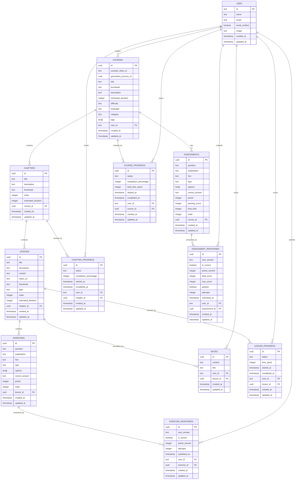

# @aristocrat/database

This package contains all database-related code for the Aristocrat project, including:

- Database connection and configuration
- Schema definitions for all tables
- Repository classes for data access
- Database utilities and helpers

## Database Schema

The database follows a hierarchical learning management structure:



## Structure

```
src/
├── index.ts          # Main exports and database connection
├── schema/           # Drizzle schema definitions
│   ├── index.ts     # Schema exports
│   ├── auth.ts      # Authentication tables (users, sessions, accounts)
│   ├── banners.ts   # Banner system tables
│   ├── courses.ts   # Course definition tables
│   ├── chapters.ts  # Course chapter tables
│   ├── lessons.ts   # Lesson content tables
│   ├── exercises.ts # Exercise and quiz tables
│   ├── assessments.ts # Final course assessment tables
│   ├── notes.ts     # User note-taking tables
│   └── progress.ts  # Progress tracking and response tables
├── repository/       # Data access layer
│   ├── index.ts     # Repository exports
│   ├── banners.ts   # Banner repository
│   └── courses.ts   # Course repository
├── utils/           # Database utilities
│   ├── index.ts     # Utility exports
│   ├── pg.ts        # PostgreSQL helpers and exports
│   └── query.ts     # Query utilities
└── migrations/      # Database migration files
```

## Key Features

### 🏗️ **Hierarchical Learning Structure**
- **Course** → **Chapters** → **Lessons** → **Exercises**
- **Course** → **Final Assessments** (parallel to chapters)
- Proper ordering at each level with `order` fields

### 📝 **Exercise & Assessment Types**
- **6 Exercise Types**: `multiple_choice`, `true_false`, `fill_blank`, `short_answer`, `code`, `drag_drop`
- **Flexible Options**: Array field for multiple choice answers
- **Points System**: Configurable scoring per exercise/assessment
- **Smart Validation**: Correct answers, explanations, and hints

### 📊 **Comprehensive Progress Tracking**
- **5 Progress Tables**: Course, Chapter, Lesson, Exercise Responses, Assessment Responses
- **Status Tracking**: `not_started`, `in_progress`, `completed`
- **Time Analytics**: Duration tracking for lessons and courses
- **Score Management**: Points earned, total scores, pass/fail status
- **Attempt History**: Multiple attempts with complete audit trail

### 📝 **Note-Taking System**
- **Lesson Annotations**: Users can add notes to any lesson
- **Optional Titles**: Structured note organization
- **Rich Content**: Full-text note storage

### ⚡ **Performance Optimizations**
- **Strategic Indexes**: All foreign keys and query patterns optimized
- **Unique Constraints**: Prevent duplicate progress entries per user
- **Composite Indexes**: Optimized for user-specific queries  
- **Cascade Deletes**: Automatic cleanup on parent record deletion

### 🔄 **Assessment Features**
- **Passing Scores**: Configurable percentage thresholds
- **Time Limits**: Optional time constraints for assessments
- **Comprehensive Scoring**: Track total score, max score, and pass status

## Usage

### Import the database connection

```typescript
import { database } from '@aristocrat/database';
```

### Use repository classes

```typescript
import { CoursesRepository } from '@aristocrat/database';

const coursesRepo = new CoursesRepository(database);
const course = await coursesRepo.get('course-id');
```

### Import schema for type definitions

```typescript
import { courses, user } from '@aristocrat/database';
```

## Available Types & Enums

### Course Difficulty
```typescript
type CourseDifficulty = 'easy' | 'medium' | 'hard';
```

### Lesson Types
```typescript
type LessonType = 'video' | 'text' | 'interactive' | 'quiz';
```

### Exercise Types
```typescript
type ExerciseType = 'multiple_choice' | 'true_false' | 'fill_blank' | 'short_answer' | 'code' | 'drag_drop';
```

### Progress Status
```typescript
type ProgressStatus = 'not_started' | 'in_progress' | 'completed';
```

### Schema Types
All tables export their TypeScript types for type-safe operations:

```typescript
import type {
  Course, InsertCourse,
  Chapter, InsertChapter,
  Lesson, InsertLesson,
  Exercise, InsertExercise,
  Assessment, InsertAssessment,
  Note, InsertNote,
  CourseProgress, InsertCourseProgress,
  ChapterProgress, InsertChapterProgress,
  LessonProgress, InsertLessonProgress,
  ExerciseResponse, InsertExerciseResponse,
  AssessmentResponse, InsertAssessmentResponse
} from '@aristocrat/database';
```

## Database Commands

All database operations should be run from this package:

```bash
# Generate migrations
bun run db:generate

# Push schema to database
bun run db:push

# Run migrations
bun run db:migrate

# Open Drizzle Studio
bun run db:studio
```

Or from the root of the monorepo:

```bash
# All commands are available from root
bun db:push
bun db:studio
bun db:generate
bun db:migrate
```
